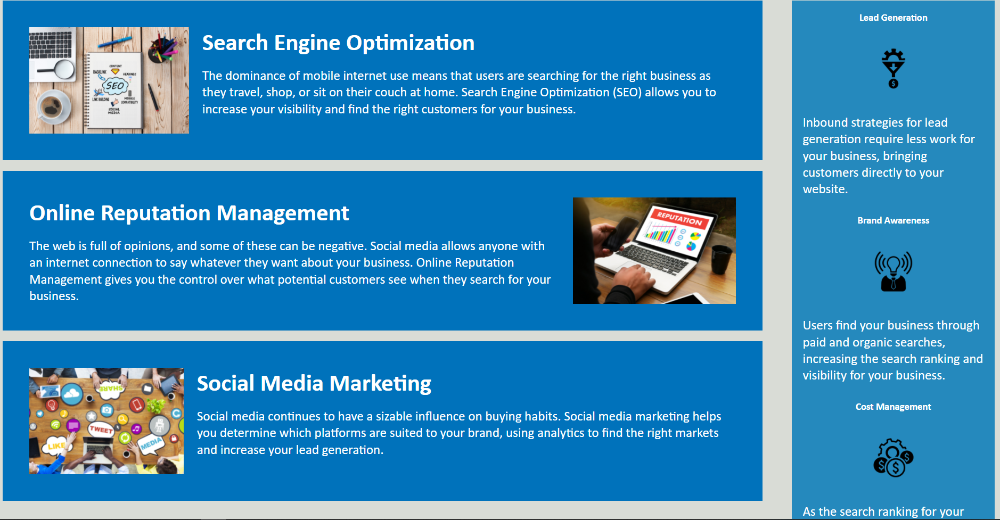

# code-refractory

This project builds a main company page for the company Horiseon. It incorporates using skills such as basic html setup and css styling to create a informative webpage that is also visibly appealing.

This project taught me skills of setting up and deploying a webpage, basic styling, and semantic structuring to keep a clean and readable code.

I hope to apply more responsive elements such as flexbox and @media to make future websites more accessible to mobile users. 

Screenshot of the webpage:

Webpage link address:
https://truont2.github.io/code-refractory/